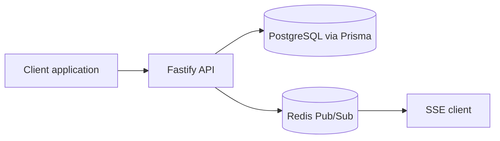

# NotifAI

A notification infrastructure platform for applications. NotifAI provides a tenant-scoped API and an embeddable user inbox, built incrementally as a TypeScript modular monolith.

## Architecture



Tenant context comes from the authenticated server API key. User external IDs are unique inside a tenant. Notifications have both tenant and user ownership, and database constraints enforce tenant-scoped idempotency.

## Phase 3 API

All routes below require `Authorization: Bearer <server-api-key>`.

| Method  | Endpoint                                                            | Purpose                                                        |
| ------- | ------------------------------------------------------------------- | -------------------------------------------------------------- |
| `POST`  | `/v1/users`                                                         | Create a tenant user by external ID                            |
| `POST`  | `/v1/notifications`                                                 | Create a notification for a tenant user                        |
| `GET`   | `/v1/notifications/:id`                                             | Retrieve a notification within the key's tenant                |
| `GET`   | `/v1/inbox?userId=...&cursor=...&limit=...&status=...&category=...` | List inbox items, newest first                                 |
| `GET`   | `/v1/inbox/unread-count?userId=...`                                 | Count non-archived unread items                                |
| `PATCH` | `/v1/inbox/:id/read`                                                | Mark an item read                                              |
| `PATCH` | `/v1/inbox/:id/unread`                                              | Mark an item unread                                            |
| `POST`  | `/v1/inbox/read-all`                                                | Mark a user's active unread items read (`{ "userId": "..." }`) |
| `PATCH` | `/v1/inbox/:id/archive`                                             | Archive an item                                                |

`POST /v1/notifications` accepts `externalUserId`, `title`, and `body`; it may also include `category`, `actionUrl`, `priority`, and `idempotencyKey`. Reusing an idempotency key within the same tenant returns the original notification. PostgreSQL's `(tenantId, idempotencyKey)` unique constraint handles simultaneous retries; the same key can be used by another tenant.

Inbox pagination uses an opaque cursor containing `createdAt` and `id`, ordered newest first. Use the returned `nextCursor` for the next request; it is `null` when no more items remain. Archived notifications are excluded by default.

Invalid request data returns `400`, missing or invalid API keys return `401`, duplicate user external IDs return `409`, and resources outside the authenticated tenant return `404`.

## Setup and verification

Prerequisites: Node.js 20+, Corepack/pnpm 10, and PostgreSQL (Docker Compose is available for local services).

```powershell
Copy-Item .env.example .env
corepack pnpm install
docker compose up -d --wait
corepack pnpm exec prisma migrate deploy
corepack pnpm exec prisma generate
corepack pnpm format:check
corepack pnpm lint
corepack pnpm typecheck
corepack pnpm test
corepack pnpm build
corepack pnpm start
```

The API listens on `http://localhost:3000`; `GET /health` returns `{ "status": "ok" }`. Phase 3 tests use Fastify's in-process `inject` API and Vitest. Stop the API with Ctrl+C and services with `docker compose down`.

## Phase 4 realtime

After a successful PostgreSQL write, the API publishes a small event to Redis Pub/Sub; an authenticated SSE stream forwards events to connected consumers. PostgreSQL remains the source of truth, Redis is transient transport, and a Redis publish failure is logged without failing the successful API write.

GET /v1/inbox/stream?userId=<user-id> requires the existing Bearer server API key and verifies that user belongs to the key's tenant. Events: notification.created, notification.read, notification.unread, notification.archived, and notification.read_all. Channels use notifai:{tenantId}:user:{userId}. The stream sends heartbeat comments and removes subscriptions on disconnect.

Native browser EventSource does not support custom Authorization headers. Never put a server key in browser code or the stream URL. A future browser SDK should use a short-lived signed token scoped to tenant, user, and expiry.

## Earlier phases and next work

Phase 1 established the workspace, API shell, Prisma, PostgreSQL, and Redis Compose services. Phase 2 added tenants and hashed server API keys. Phase 3 adds tenant users, notifications, inbox actions, pagination, and idempotency. Phase 4 adds Redis Pub/Sub and authenticated SSE realtime delivery.

## Phase 5 async email delivery

A notification and its EMAIL Delivery row are created together in PostgreSQL. If the user has no email, the delivery is recorded as FAILED with a reason and no job is queued. Otherwise the API enqueues only deliveryId and notificationId in the notification-email BullMQ queue and returns without waiting for email sending.

The worker loads current notification and user data from PostgreSQL, then uses the EmailProvider interface. The local mock provider logs metadata only; it sends no real email. BullMQ retries temporary errors up to three attempts with exponential backoff starting at one second. Permanent provider errors stop retries. Final failed jobs remain in BullMQ for inspection, and Delivery records FAILED with the final error. Delivery status can be read at GET /v1/deliveries/:id by an API key belonging to the notification's tenant.

PostgreSQL remains the source of truth; Redis carries both Phase 4 Pub/Sub messages and Phase 5 BullMQ jobs using separate connections. If job enqueueing fails, the notification remains created and its delivery is recorded as FAILED when possible. There is no transactional outbox in this phase.

For local development, run the API and worker in separate VS Code terminals: corepack pnpm dev and corepack pnpm dev:worker. Build and run the worker with corepack pnpm build and corepack pnpm worker. Configure EMAIL_PROVIDER=mock and EMAIL_FROM in .env; no email credentials are needed.

## Phase 6 preferences, DND, and digest foundation

Preferences are stored per user and category. Missing channel preferences default to enabled for IN_APP and EMAIL; explicit rows override that default. Categories are free-form strings, with uncategorized notifications evaluated as `default`. Preferences are accessed only after verifying the user belongs to the API key tenant.

`PUT /v1/preferences` updates one `{ userId, category, channel, enabled }` rule; `GET /v1/preferences?userId=...` lists stored rules and effective defaults. Disabling EMAIL suppresses only the external email attempt. The notification remains in PostgreSQL, inbox, and realtime flow; its EMAIL Delivery is marked `SUPPRESSED` with a reason and is not queued.

DND can be configured with `PUT /v1/preferences/dnd` and read with `GET /v1/preferences/dnd?userId=...`. Its `enabled`, `startTime`, `endTime`, and IANA `timezone` settings support windows crossing midnight. DND never deletes inbox notifications. While active, immediate email is suppressed and recorded; this phase does not schedule a later send. The worker checks preferences and DND again immediately before sending, so settings changed after enqueueing are respected.

Digest configuration uses `PUT /v1/preferences/digest` and `GET /v1/preferences/digest?userId=...`; it stores enabled, DAILY/WEEKLY frequency, EMAIL channel, preferred local time, and timezone. Digest generation, scheduling, and sending are not implemented yet.

Delivery decision flow: Notification ? preference check ? DND check ? Delivery/BullMQ when allowed ? worker rechecks ? email. PostgreSQL remains authoritative; `SUPPRESSED` is a terminal observable result for this phase.
